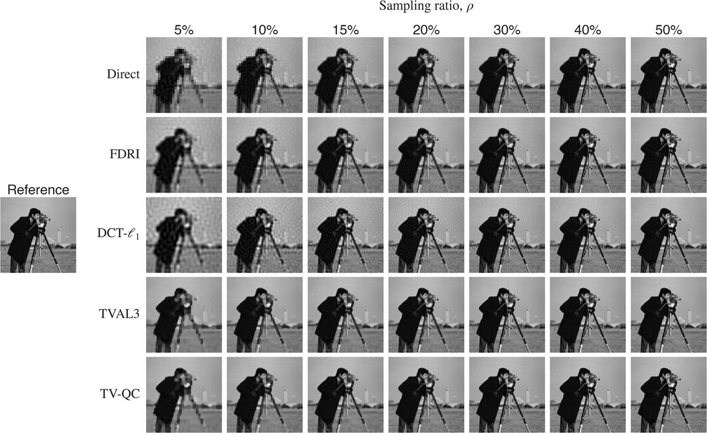
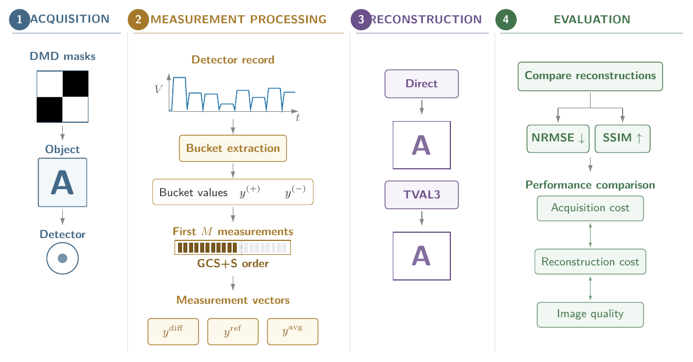

# Hadamard-based single-pixel imaging tutorial — MATLAB workflows

This repository contains the reader-facing MATLAB workflows supporting
**“Hadamard-Based Single-Pixel Imaging: From Detector Signals to Image Reconstruction.”**

> **Software v1.2.0.** This release contains the post-peer-review TVAL3 standardization, revised frozen Sections 7–8 results, and reader-tested instructions for both numerical workflows. Historical release `v1.1.0` remains unchanged.

The software provides two complementary workflows:

1. **Sections 7–8 — simulation and reconstruction comparison**
2. **Section 9 — processing companion experimental detector signals**

## Start here — which command should I run?

| I want to... | Start in | Commands | Extra download |
|---|---|---|---|
| View/reproduce the validated Sections 7–8 tutorial figures | `matlab/section7_8_simulation/` | `CHECK_INSTALLATION`, then `REPRODUCE_TUTORIAL_RESULTS` | None |
| Run a new Sections 7–8 Direct + TVAL3 simulation | `matlab/section7_8_simulation/` | `CHECK_INSTALLATION`, then `RUN_SIMULATION` | None |
| Run the complete five-method Sections 7–8 simulation | `matlab/section7_8_simulation/` | `INSTALL_EXTERNAL_DEPENDENCIES`, `CHECK_INSTALLATION`, then `RUN_SIMULATION` | L1-Magic + FDRI ZIPs |
| Reprocess the Section 9 experimental data | `matlab/section9_pipeline/` | install dataset payload, `CHECK_INSTALLATION`, then `RUN_SECTION9_ANALYSIS` | Companion experimental dataset |

For the detailed, step-by-step instructions, see:

- [Sections 7–8 simulation guide](matlab/section7_8_simulation/README.md)
- [Section 9 experimental-data guide](matlab/section9_pipeline/README.md)

## Sections 7–8 — simulation

### A. Reproduce the validated tutorial results

From `matlab/section7_8_simulation/`, run:

```matlab
CHECK_INSTALLATION
REPRODUCE_TUTORIAL_RESULTS
```

This reads the supplied frozen numerical results and regenerates the reader-facing reproductions of Figures 13–16. **No reconstruction solver is executed.** Outputs are written to:

```text
matlab/section7_8_simulation/figures/tutorial_reproduction/
```

A representative expected output is shown below.



### B. Run a new Direct + TVAL3 simulation

Direct and TVAL3 are available without L1-Magic or FDRI:

```matlab
CHECK_INSTALLATION
RUN_SIMULATION
```

If L1-Magic or FDRI is absent, its corresponding stage is skipped. Direct and TVAL3 still run, and the quality-evaluation stage evaluates only the methods produced in that clean run.

### C. Run the complete five-method simulation

The complete workflow uses Direct, FDRI, DCT-l1, TVAL3, and TV-QC. TVAL3 is bundled. Download the other two repositories as ZIP files:

- **L1-Magic:** https://github.com/scgt/l1magic
- **FDRI-single-pixel-imaging:** https://github.com/KMCzajkowski/FDRI-single-pixel-imaging

On each GitHub page choose **Code → Download ZIP**. Keep those two downloads as ZIP files; **do not extract them manually**. Then run:

```matlab
INSTALL_EXTERNAL_DEPENDENCIES
CHECK_INSTALLATION
RUN_SIMULATION
```

`INSTALL_EXTERNAL_DEPENDENCIES` asks you to select the downloaded ZIP files and installs the required files locally under `external_dependencies/`.

For the full run, `CHECK_INSTALLATION` should report:

```text
TVAL3: available
L1-Magic: available
FDRI: available
Full five-method simulation: READY
```

A `NOT YET READY` line is a status message for that particular path, not a failure of the paths whose requirements are already available.

New-run outputs are kept separate from the frozen tutorial results:

```text
matlab/section7_8_simulation/results/
matlab/section7_8_simulation/figures/simulation/
```

To use the tutorial image, keep `imageMode = "tutorial"` at the top of `RUN_SIMULATION.m`. Set `imageMode = "choose"` to select another image interactively.

See the [Sections 7–8 simulation guide](matlab/section7_8_simulation/README.md) for sampling-ratio settings, expected outputs, and solver notes.

## Section 9 — experimental detector-signal reconstruction

The experimental data are **not bundled inside the software package**. They are a separate companion dataset so that software versioning and experimental-data provenance remain distinct.

**Reserved companion dataset DOI:** `10.5281/zenodo.22070080` — dataset publication pending.

### 1. Install the dataset payload

Download and extract the companion dataset. Copy the **contents of its `payload/` directory**, not the `payload` directory itself, into:

```text
matlab/section9_pipeline/
```

After copying, these paths should exist directly inside `section9_pipeline/`:

```text
raw/paw_print/
raw/USAF/
raw/logo/
data/pattern_manifest.csv
reference_results/paw_print/
reference_figures/paw_print/
```

If you instead see `matlab/section9_pipeline/payload/raw/...`, the payload is nested one level too deep.

### 2. Check the installation

Open MATLAB with `matlab/section9_pipeline/` as the current folder and run:

```matlab
CHECK_INSTALLATION
```

Continue only after the final line reports:

```text
Installation ready.
```

### 3. Run the manuscript example

In the **User settings** section of `RUN_SECTION9_ANALYSIS.m`, keep:

```matlab
selectedDataset = "paw_print";
generateFigures = true;
```

Then run:

```matlab
RUN_SECTION9_ANALYSIS
```

`paw_print` is the Section 9 manuscript case. After that run succeeds, you can repeat the same workflow with `selectedDataset = "USAF"` or `selectedDataset = "logo"` as additional reader examples.

The analysis follows the tutorial chain shown below.



A successful `paw_print` run processes 16,384 positive and 16,384 complementary bucket values, evaluates the 5:5:100% sampling grid, produces Direct and TVAL3 reconstructions, computes image-quality metrics, and exports the S9_01–S9_05 figure family.

Expected numerical outputs are written to:

```text
results/paw_print/bucket_measurements.mat
results/paw_print/measurement_vectors.mat
results/paw_print/direct_reconstructions.mat
results/paw_print/tval3_reconstructions.mat
results/paw_print/quality_metrics.csv
results/paw_print/quality_evaluation.mat
```

Expected figure outputs are written under `figures/paw_print/` as:

```text
S9_01_detector_and_measurement_vectors.[png|pdf|eps]
S9_02_ydiff_direct_vs_tval3_partial.[png|pdf|eps]
S9_03_yref_direct_vs_tval3_partial.[png|pdf|eps]
S9_04_yavg_direct_vs_tval3_partial.[png|pdf|eps]
S9_05_all_paths_quality_nrmse_ssim.[png|pdf|eps]
```

The installed reference checkpoints remain separate and are never overwritten by the normal reader workflow.

See the [Section 9 experimental-data guide](matlab/section9_pipeline/README.md) for the full clean-room procedure and troubleshooting notes.

## Requirements

### Sections 7–8

- MATLAB
- Image Processing Toolbox (`imresize`, `ssim`)
- bundled TVAL3 beta 2.4
- L1-Magic ZIP only for DCT-l1 and TV-QC in the complete five-method run
- FDRI ZIP only for FDRI in the complete five-method run

### Section 9

- MATLAB
- Image Processing Toolbox (`imresize`, `ssim`)
- Signal Processing Toolbox (`findpeaks`)
- bundled TVAL3 beta 2.4
- separately distributed companion experimental dataset

The post-peer-review reader workflows have been clean-room exercised with MATLAB R2026a on Windows 64-bit. This is a tested environment, not a minimum-version claim. Timing and iterative-solver trajectories can vary with hardware and MATLAB update level.

## Reproducibility structure

The repository intentionally separates:

- frozen tutorial-result reproduction;
- reader-generated simulation results;
- experimental raw-data processing;
- third-party solver code;
- reader-installed external solver dependencies;
- the separately versioned experimental dataset.

This keeps manuscript reference results distinct from newly generated outputs.

## Licensing

Original tutorial code is released under the **BSD 3-Clause License**.

Bundled TVAL3 beta 2.4 is third-party software and is not covered by the BSD 3-Clause License. L1-Magic and FDRI are not redistributed by this repository. See `LICENSE_SCOPE.md`, `THIRD_PARTY_NOTICES.md`, and `LICENSES/` for exact scope and provenance.

The companion experimental dataset is intended for separate release under **CC BY 4.0**.

## Citation

Citation metadata for the software are provided in `CITATION.cff`.

- Historical software v1.1.0 DOI: `10.5281/zenodo.22133874`
- Historical software v1.0.0 DOI: `10.5281/zenodo.22070980`
- Reserved companion dataset DOI: `10.5281/zenodo.22070080` — publication pending

The Zenodo DOI for software v1.2.0 is assigned by the archive after the software release is deposited, so it may postdate this source snapshot. The tutorial/article DOI will be added when it exists.
